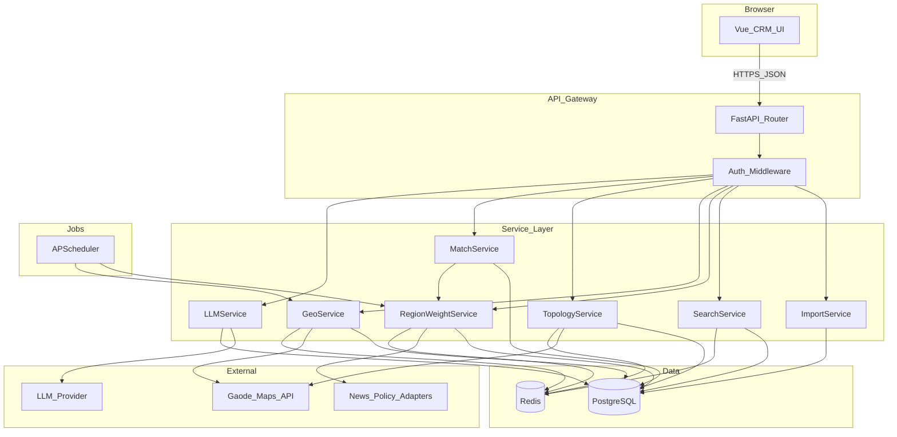

# 企业数据智能管理检索系统 — 设计文档

**版本**：1.0  
**适用**：今晚加急落地、轻量化部署、后续可扩展  
**交付形态**：单文档定义前后端契约、数据模型、算法参数与部署方式，开发可直接照表实现。

---

## 目录

1. [项目概述](#1-项目概述)
2. [技术栈选型](#2-技术栈选型)
3. [系统架构](#3-系统架构)
4. [前端页面结构](#4-前端页面结构)
5. [后端接口设计](#5-后端接口设计)
6. [数据库表结构](#6-数据库表结构)
7. [核心算法与实操方案](#7-核心算法与实操方案)
8. [Excel 一键导入](#8-excel-一键导入)
9. [第三方 API 与合规](#9-第三方-api-与合规)
10. [功能实现步骤](#10-功能实现步骤)
11. [加急开发排期](#11-加急开发排期)
12. [部署方案](#12-部署方案)
13. [非功能与扩展预留](#13-非功能与扩展预留)
14. [附录 A：docker-compose 示例](#附录-adocker-compose-示例)
15. [附录 B：建表 SQL 与 OpenAPI 样例](#附录-b建表-sql-与-openapi-样例)

---

## 1. 项目概述

### 1.1 背景

业务侧已积累大量**网络爬取的 Excel 企业基础数据**（表头不统一、列数多、字段含义相近）。需搭建一套**轻量化、CRM 式交互**的企业数据智能管理检索系统，在**不牺牲原始信息完整性**的前提下，支持多条件标签化检索、区域行业权重、AI 分析、地图可视化、空间距离拓扑、行业优先级匹配，并支持快速上线与简单运维。

### 1.2 目标用户

- 一线销售/客拓：从海量企业中快速筛出高意向对象。
- 运营/分析：看区域行业热度与分布，做策略复盘。
- 内网技术：低运维成本、可单栈部署、接口清晰可接第三方。

### 1.3 非目标（本阶段不做）

- 不引入大数据平台（Flink/Spark 等）与多集群编排（K8s 可后续再上）。
- 不承诺「全网企业工商实时全量」的权威主数据，本系统以**已导入 Excel 为事实源**。
- 不实现复杂多租户运营后台（可预留 `tenant_id` 字段）。

### 1.4 设计原则

| 原则 | 说明 |
|------|------|
| 轻量优先 | 单仓库前后端分离 + 单机/compose 可跑全栈。 |
| 数据不丢 | 所有 Excel 列写入 `raw_data`（JSONB），标准列为检索加速列。 |
| 可配置扩展 | 字段映射 YAML、权重参数表、新闻/政策适配器可插拔。 |
| 失败可观测 | 导入、外部 API、任务均有 `task_id` + 日志，便于加急期排障。 |

---

## 2. 技术栈选型

| 层 | 选型 | 说明 |
|----|------|------|
| 前端 | Vue 3 + Vite + TypeScript + Element Plus | 快速搭 CRM 表格/筛选/分页/抽屉。 |
| 状态 | Pinia | 轻量。 |
| 图表 | ECharts 5+ | 行业权重趋势、舆情热度柱状图。 |
| 地图 | 高德 JS API 2.0 +（可选）Loca 热力/聚合 | 国内资质与能力成熟。 |
| 后端 | Python 3.11+、FastAPI、Uvicorn | 自动生成 OpenAPI、异步 I/O 友好。 |
| Excel | pandas、openpyxl | xlsx 批量；xls 可用 xlrd 或先转 xlsx。 |
| ORM | SQLAlchemy 2.x + Alembic | 迁移可控。 |
| 任务 | APScheduler（内嵌）或 Celery+Redis | 加急期优先 APScheduler 减组件。 |
| 主库 | PostgreSQL 15+ | JSONB 存动态字段、便于索引策略。 |
| 缓存 | Redis 7+ | 热点查询、限流、地理编码/路径缓存。 |
| LLM | OpenAI 兼容 HTTP（含国内厂商网关） | 统一 client，切换模型不改业务代码。 |

**可选增强（非首晚必做）**：

- PostGIS：大规模空间查询；首版用 bbox + Haversine 可够用。
- `pg_trgm` + GIN：中文企业名模糊检索（首版可先用 `LIKE` + 长度限制，再换 trigram）。

---

## 3. 系统架构

### 3.1 逻辑分层



**异步与缓存边界**：

- 导入、全量重算行业权重、批量地理补全：**异步任务**（`import_id` / `job_id` 可轮询或 SSE）。
- 企业列表、地图点聚合结果、geocode、路径规划：**Redis 短 TTL 缓存**。

### 3.2 主数据流（检索）

1. 前端将筛选 + 关键词 + 分页发 `POST /api/v1/companies/search`。
2. `SearchService` 解析为 SQL（标准列 + JSONB 子句可选）+ `COUNT`。
3. 热点条件组合可写 Redis key（`search:{hash}`，TTL 60s）。

---

## 4. 前端页面结构

### 4.1 全局布局（CRM 简约风）

- **顶栏**：模块切换（数据管理 / 企业库 / 地图 / AI 中心 / 拓扑与匹配 / 系统设置）。
- **左侧筛选栏**（可折叠）：
  - 城市/区县、行业/细分行业
  - 多选**标签**（`tags`），支持组内 **AND / OR**（见下）
  - 风险等级、成立年限、注册资本范围（若有列）
  - 关键词、精准/模糊切换
  - 「应用筛选 / 重置」
- **中部主区**：
  - 默认：表格 + 分页 + 行操作（查看详情、打标签、发起 AI 分析、地图定位）
- **详情抽屉**：
  - 标准字段 + 原始 `raw_data` 全量展示（可折叠 JSON 树 / key-value）
- **地图页**：全宽地图 + 与筛选区同步的浮层面板 + 点聚合/热力切换
- **AI 中心**：单企业分析 / 城市行业解读 / 商机与竞争简析（分 Tab）
- **拓扑页**：选中心企业 + k + 距离类型 + 图可视化（可用 ECharts graph 或轻量 canvas）

### 4.2 标签多条件组合策略（约定）

- **同组内 OR**：例如标签组「制造业」为 `{A,B}`，命中任一即可加进候选（可配置，默认**组内 OR**）。
- **组间 AND**：城市 = 某市 **且** 行业 in [...] **且** 至少命中标签组 1 **且** 标签组 2。
- 前端将结构序列化为 `filter_groups`（见 [5.3](#53-企业检索)），后端统一解析，避免各端各写一套逻辑。

### 4.3 列表与地图联动

- 选表格行：地图 `panTo` 并 `highlight` 该点。
- 点地图 `marker`：高亮行 + 打开 mini 信息窗（名称 + 行业 + 3 个关键字段 +「详情」）。

---

## 5. 后端接口设计

**Base URL**：`/api/v1`  
**Content-Type**：`application/json`（除文件上传）。  
**鉴权**（可配置）：

- `Authorization: Bearer <token>`，开发环境可 `AUTH_DISABLED=true` 关闭校验（**生产必开**）。

### 5.1 统一响应包

**成功**：

```json
{
  "ok": true,
  "data": { },
  "request_id": "uuid"
}
```

**失败**：

```json
{
  "ok": false,
  "error": {
    "code": "VALIDATION_ERROR",
    "message": "人类可读",
    "details": { }
  },
  "request_id": "uuid"
}
```

**错误码表（节选）**

| HTTP | code | 说明 |
|------|------|------|
| 400 | VALIDATION_ERROR | 参数不合法 |
| 401 | UNAUTHORIZED | 未登录/ token 无效 |
| 404 | NOT_FOUND | 资源不存在 |
| 409 | CONFLICT | 重复导入/版本冲突（可选） |
| 413 | PAYLOAD_TOO_LARGE | 上传超限 |
| 429 | RATE_LIMITED | 限流（外部 API 或本系统） |
| 500 | INTERNAL_ERROR | 未处理异常（对外隐藏栈） |
| 502 | UPSTREAM_ERROR | 外部服务失败（地图/LLM/新闻） |

### 5.2 Excel 导入

| 方法 | 路径 | 说明 |
|------|------|------|
| POST | `/import/excel` | `multipart/form-data`：`file`，可选 `source_label` |
| GET | `/import/{import_id}/status` | 进度、映射摘要、错误摘要 |
| GET | `/import/{import_id}/errors?limit&offset` | 失败行明细（可选分页） |

**`POST /import/excel` 响应 `data` 示例**：

```json
{
  "import_id": "imp_9f2a1c",
  "status": "processing",
  "sheets": ["Sheet1"],
  "field_mapping": {
    "企业名称": "name",
    "城市": "city",
    "未知列X": "raw_data.x"
  }
}
```

### 5.3 企业检索

`POST /companies/search`

**请求体**：

```json
{
  "keyword": "科技",
  "match_mode": "fuzzy",
  "filters": {
    "city": ["杭州"],
    "industry": ["软件和信息服务业"],
    "filter_groups": [
      { "logic": "or", "tags": ["专精特新", "高新技术"] }
    ],
    "risk": ["low", "medium"]
  },
  "sort": { "field": "updated_at", "order": "desc" },
  "page": 1,
  "page_size": 20
}
```

**响应 `data` 重点字段**：

- `items[]`：含 `id`, `name`, 标准列, `tags`, `raw_data`（可配置是否默认省略大字段，用 `?include=raw`）
- `total`, `page`, `page_size`
- `facets`：可选，各维计数（加急可后置）

`GET /companies/{id}`：单条详情。  
`PATCH /companies/{id}`：可更新 `tags`、可规范地址触发重新 geocode（`{"address": "...", "regeocode": true}`）。  
`DELETE /companies/{id}`：软删或硬删（建议 `deleted_at` 软删）。

### 5.4 区域行业权重

| 方法 | 路径 | 说明 |
|------|------|------|
| GET | `/regions/{city}/industry-weights?date&limit` | 城市行业权重排序表 |
| POST | `/jobs/region-weights/refresh` | 触发重算，body：`{"cities": ["杭州"], "full": false}` |

**GET 响应 `items` 单条**：

```json
{
  "industry": "软件和信息服务业",
  "N_norm": 0.72,
  "P_norm": 0.45,
  "M_norm": 0.60,
  "W": 0.59,
  "trend_7d": [0.5,0.55,0.59],
  "as_of": "2026-04-27T18:00:00+08:00"
}
```

### 5.5 地图点位

| 方法 | 路径 | 说明 |
|------|------|------|
| GET | `/map/companies` | Query 与 `search` 同构（GET 有长度限制，复杂筛选用 POST 镜像接口可选） |
| GET | `/map/aggregate` | bbox + zoom 返回聚合点（后台 cluster） |

**Query 示例**：`city=杭州&industry=软件&bbox=...&max_points=2000&cluster=true`

### 5.6 空间拓扑

`POST /topology/nearest`

```json
{
  "company_id": 10001,
  "k": 20,
  "distance_type": "straight",
  "industry_filter": null,
  "max_km": 100
}
```

**响应**：

- `neighbors[]`：企业摘要 + 距离 + 同边权重（若有）
- `graph`：`nodes` + `edges`（ECharts/前端通用格式）

`distance_type` 枚举：`straight` | `traffic`（需双方坐标齐全且调用地图路径 API）。

### 5.7 行业优先级匹配

`POST /match/prioritize`

```json
{
  "center_city": "杭州",
  "target_industries": ["软件和信息服务业"],
  "tag_preferences": { "any": ["高新技术"], "all": [] },
  "max_results": 200,
  "use_ai_intent": true
}
```

**响应**：`ranked[]` 带 `match_score` 与 `reason` 对象（见 [7.3](#73-行业优先级智能匹配)）。

### 5.8 AI 分析

| 方法 | 路径 | 说明 |
|------|------|------|
| POST | `/ai/company` | 单企业多维度分析 |
| POST | `/ai/region-industry` | 某城市+行业竞争与机会 |
| POST | `/ai/opportunity` | 结合权重与候选企业的商机简析 |

**`POST /ai/company` 输入**：

```json
{ "company_id": 10001, "objectives": ["risk", "intent", "deal_hint"] }
```

**输出**（`analysis` 建议固定 schema，见附录 B 思路）：`summary`, `risks[]`, `intent_level`, `suggested_tags[]`, `citations`（如引用内部字段名，便于审计）。

---

## 6. 数据库表结构

**命名**：`snake_case`；**时区**：存储 UTC，API 可转东八区。

### 6.1 核心表

**`company`**

| 列 | 类型 | 说明 |
|----|------|------|
| id | bigserial PK | 内部主键 |
| name | text not null | 企名，索引 |
| credit_code | text | 统一社会信用代码，可唯一（若有） |
| city | text | 标准化后城市名 |
| district | text | 区县 |
| address | text | 用于 geocode |
| industry | text | 主行业 |
| sub_industry | text | 细分（可选） |
| lat, lng | double precision | 可为空，导入后补全 |
| tags | jsonb default '[]' | 标签数组 |
| raw_data | jsonb not null default '{}' | **全量原始列** |
| import_id | text | 来自哪次导入 |
| source_row | int | 源行号，便于对账 |
| created_at, updated_at | timestamptz | 审计 |
| deleted_at | timestamptz | 软删 |

**索引建议**：

- `CREATE INDEX idx_company_name ON company USING gin (name gin_trgm_ops);`（需 `pg_trgm` 扩展，可选）
- `CREATE INDEX idx_company_city_industry ON company (city, industry) WHERE deleted_at IS NULL;`
- `CREATE INDEX idx_company_lat_lng ON company (lat, lng) WHERE lat IS NOT NULL;`
- `GIN (raw_data jsonb_path_ops)` 仅在需 JSON 路径查时加（首版可不加，避免写放大）

**`import_task`**

| 列 | 类型 | 说明 |
|----|------|------|
| id | text PK | `import_id` |
| file_name, file_hash | text | 去重/幂等可复用 |
| status | text | processing/success/partial/failed |
| field_mapping | jsonb | 列→标准/ raw 的映射结果 |
| total_rows, success_rows, failed_rows | int | 统计 |
| error_log | text | 总览 |
| created_at, finished_at | timestamptz | |

**`region_industry_weight`**

| 列 | 类型 | 说明 |
|----|------|------|
| id | bigserial PK | |
| city | text not null | |
| industry | text not null | |
| N_raw, P_raw, M_raw | double precision | 可存原始量 |
| N_norm, P_norm, M_norm | double precision | 0~1 |
| W | double precision not null | 综合权重 |
| as_of | date 或 timestamptz | 快照时间 |
| meta | jsonb | 源统计、条数、置信度说明 |

**唯一建议**：`UNIQUE (city, industry, as_of::date)`（按天快照）。

**`company_ai_analysis`**

| 列 | 类型 | 说明 |
|----|------|------|
| id | bigserial | |
| company_id | bigint FK | |
| model | text | 模型名 |
| payload | jsonb | 请求摘要（脱敏） |
| result | jsonb | 结构化结果 |
| created_at | timestamptz | |

**`company_distance_cache`**

| 列 | 类型 | 说明 |
|----|------|------|
| a_id, b_id | bigint | `a_id < b_id` 规范存储 |
| straight_km | double precision | |
| traffic_km, traffic_minutes | double precision | 可空，依赖 API |
| updated_at | timestamptz | TTL 7 天可重算 |

**`match_result`（可选，审计）**

| 列 | 类型 | 说明 |
|----|------|------|
| id | bigserial | |
| request_hash | text | 同请求复用 |
| params | jsonb | 请求体 |
| ranked | jsonb | 结果前 N |
| created_at | timestamptz | |

**`app_config`（键值，权重参数可放库）**

| key | value jsonb | 如 `region_weight.alpha` |

### 6.2 多租户与扩展（预留）

- 增加 `tenant_id uuid default '00000000-0000-0000-0000-000000000001'`，全表索引带上（首版可固定单租户实现）。

---

## 7. 核心算法与实操方案

### 7.1 区域热点行业权重

**可观测原始量**（加急落地三源，均可逐步替换为更强 API）：

- **N（舆情热度）**：近 7 天新闻条数 + 标题/正文关键词 hits + 简单情感（-1~1 映射 0~1 再加权）→ 合成为 `N_raw`。
- **P（行业政策）**：同窗口政策/通报条数、来源级别权重（国家级 > 省 > 市）→ `P_raw`。
- **M（市场动态）**：可选代理量：招聘贴增长、投融条数、专利新增等（有则合并；无则置 0 并降低置信度，见**降级**）。

**归一化**（对同一 `city`、同一批 `as_of` 窗口内、跨行业横比）：

\[
X_{\text{norm},i} = \frac{X_i - \min_j X_j}{\max_j X_j - \min_j X_j + 10^{-9}}
\]

**行业权重**（默认参数，可写入 `app_config`）：

\[
W = 0.45\,N_{\text{norm}} + 0.35\,P_{\text{norm}} + 0.20\,M_{\text{norm}}
\]

**时间衰减**（对每日增量合并到滑动窗口，指数衰减 7 天）：

\[
X_{\text{ewm}}(t) = 0.7 \cdot X_{\text{ewm}}(t-1) + 0.3 \cdot X_t
\]

**缺数据降级**（实操必须写死）：

| 情况 | 行为 |
|------|------|
| 无 P 源 | `P_raw=0`，`W = (0.45/0.8)N_norm + (0.20/0.8)M_norm` 重归一或直接用二源公式并文档注明 |
| 全源异常 | 返回 `W=null`，`confidence=low`，列表仍按库内**企业计数**做备用排序（后台可见开关） |
| 抓取失败 | 不覆盖昨日快照，延长 `stale` 状态并告警（日志 + 响应 `meta`） |

**任务频率**：

- 增量：每 6h；全量日切：每天 02:00（时区可配置为 `Asia/Shanghai`）。

### 7.2 距离、近邻与拓扑

**1）直线距离（Haversine，地球半径 R=6371.0088 km）**

\[
a = \sin^2\frac{\Delta\phi}{2} + \cos\phi_1 \cos\phi_2 \sin^2\frac{\Delta\lambda}{2},\quad
d = 2R \arcsin(\sqrt{a})
\]

**2）交通距离**

- 高德**驾车路径规划 2.0**（起终点经纬度），取 `distance` 米 / `duration` 秒；入 Redis：`geo:route:{origin_hash}:{dest_hash}` TTL 7d。

**3）K 近邻（加急可落地两阶段）**

- **粗筛**：在 `(lat,lng)` 上取 `|lat-lat0| <= dlat` 且 `|lng-lng0| <= dlng`，`dlat, dlng` 由 `max_km` 换算；若无索引则 bbox 可先用 `lat BETWEEN` + `lng BETWEEN`（注意经度在极地附近不适用，可忽略中国场景）。
- **精排**：算 Haversine，取 Top `3k` 再对 Top-K 调交通 API（若 `distance_type=traffic` 且 k≤30 可全调；k 大则只对直线 Top 50 调交通）。

**4）无向图边**

- 若 \(d \le d_{\max}\) 且 `industry_similarity >= s_min`（同大类=1.0，跨类用简单映射表=0.5/0.2），建边，边权 \(w = \alpha (1 - d/d_{\max}) + \beta \cdot similarity\)。默认 `d_max=15` km, `s_min=0.3`, `α=0.6`, `β=0.4`。
- 输出**连通分量**中邻居作为「关联企业群」的辅助视图；首版不必上复杂社区发现算法，避免今晚超时。

### 7.3 行业优先级智能匹配

对每家企业给匹配分 `S`（0~100）：

\[
S = 100 \cdot (0.40 \cdot I + 0.30 \cdot T + 0.20 \cdot A + 0.10 \cdot D)
\]

- `I`：`RegionIndustry` 的 `W` 在目标行业上归一（若多行业取 max 或加权，参数化）。
- `T`：标签与画像 Jaccard（可选加权）：  
  `|tags ∩ target| / |target|` 或目标含 `all/any` 的自定义。
- `A`：AI 意向（`A=1,0.7,0.4,0.2` 分别映射高/中/低/无）；无 AI 时用规则：`注册资本区间`、`成立年限>3` 等**业务可选规则**给默认分。
- `D`：与「关注中心点」的反向距离分：\(D = 1 - \min(1, d/50{\rm km})\) 或用城市内分位数归一。

**`reason`（JSON，返回前端）**：

```json
{
  "I": { "value": 0.82, "source": "region_industry_weight", "city": "杭州" },
  "T": { "value": 0.66, "matched": ["高新技术"], "missing": [] },
  "A": { "value": 0.7, "label": "medium" },
  "D": { "value": 0.55, "km": 12.3, "type": "straight" }
}
```

**缓存**：同请求体 hash 存 5 分钟。

---

## 8. Excel 一键导入

### 8.1 表头识别

1. 每个 sheet 读首行；若**空单元格比例 > 40%** 或明显非表头，则对第 2~5 行试判：取**非空最多**且**字符串率最高**行作为表头行。
2. 列名清洗：`strip`、全角转半角、去连续空格、统一括号。

### 8.2 字段自动映射

- 维护 `config/field_mapping.yaml` 同义词，例如：  
  `name: [企业名称, 公司名称, Name, 主体名称]`；`city: [城市, 所在地市]`；`address: [地址, 注册地址]` 等。
- 首行匹配**不区分大小写**、**包含**子串也计分，选分高者；**未识别列**一律进入 `raw_data[列名原文]`，值保持字符串/数字/日期**原样 JSON 可序列化**（日期转 ISO 8601 字符串并保留 `raw` 原字符串字段可选）。

### 8.3 批处理与错误

- Pandas 分块读（如 5000 行一批）+ `INSERT ...` 批提交。
- 单行失败：记 `import_errors` 表或 JSONL 落盘，**不阻断整批**（`partial`）。
- 幂等策略（二选一做配置）：  
  - A）按 `file_hash + source_row` 去重；  
  - B）有 `credit_code` 时 upsert 按信用代码；  
  首版建议 **A 简单**。

---

## 9. 第三方 API 与合规

| 能力 | 默认 | 主要接口 | 限流与缓存 |
|------|------|----------|------------|
| 地图底图+标记 | 高德 | JS 端 key，服务端 geocode/路径用 Web 服务 | Redis 1~7d |
| 地理编码 | 高德 | `/v3/geocode/geo` 等 | 同地址同结果强缓存 |
| 路径 | 高德 | 驾车规划 | 结果缓存、失败指数退避 |
| 新闻/政策 | 可插拔 | 聚合类 API 或官方 RSS/政务 JSON | 去重 hash、尊重 robots 与 TOS |
| LLM | OpenAI 兼容 | `POST /v1/chat/completions` | 超时 15s、重试 1 次、降级规则引擎 |

**环境变量清单（示例，不含真密钥）**：

- `AMAP_KEY_SERVER`, `AMAP_KEY_WEB`  
- `LLM_BASE_URL`, `LLM_API_KEY`, `LLM_MODEL`  
- `NEWS_API_KEY`（如用第三方）  
- `DATABASE_URL`, `REDIS_URL`  
- `AUTH_DISABLED`（仅开发）

**合规**：对外抓取新闻展示摘要+链接，正文存储遵守版权；爬取有频率限制与 User-Agent 标识。

---

## 10. 功能实现步骤

| 阶段 | 内容 | 与章节对应 |
|------|------|------------|
| A1 | 工程脚手架、DB 建表、健康检查、配置加载 | 6,12 |
| A2 | Excel 导入 + 映射 + `raw_data` 入库 + 状态查询 | 8,5.2 |
| A3 | 企业检索 + 分页 + 详情 + 标签更新 | 5.3,4 |
| A4 | 地图点位 + bbox + 地理编码补全 | 5.5,9 |
| A5 | 区域权重 v1（规则+定时）+ 列表 | 5.4,7.1 |
| A6 | AI 公司级分析（schema 固定）| 5.8 |
| B1 | 拓扑 K 近邻 + 图数据 | 5.6,7.2 |
| B2 | 行业匹配 + reason | 5.7,7.3 |
| B3 | 舆情源替换为更强多适配器、facets、导出 | 扩展 |

---

## 11. 加急开发排期（参考：今晚）

| 时段 | 目标 | 验收点 |
|------|------|--------|
| 0~2h | 后端表 + 导入 + 单测路径 | 任意 xlsx 可入 `raw_data` |
| 2~4h | 搜索 API + 简单前端表 | 分页+筛选可用 |
| 4~6h | 地图页 + 高德 key 联调 | 有点位与聚合 |
| 6~8h | 权重任务 + 面板 + AI 一接口 | 权重列表与 AI 抽屉 |
| 8~10h | 拓扑 + 匹配 + 全链路联调 | 文档内接口全绿（沙箱数据） |
| 10h+ | compose 部署、压测、文档定稿 | 可演示上线包 |

---

## 12. 部署方案

- **形态**：单台云主机 + Docker Compose（见 [附录 A](#附录-adocker-compose-示例)）。
- **反代**：Nginx 对 `/api` 反代到 Uvicorn，静态 `dist` 对 `/`。
- **健康检查**：`GET /healthz`（DB+Redis+可选外部探活不阻塞，仅打标 degraded）。
- **日志**：`JSON` 一行一对象，`request_id` 全链路透传。
- **备份**：`pg_dump` 每日 03:00；上传物（Excel 原档）可落对象存储或本地只读盘。
- **回滚**：镜像 tag 固定，compose 中写死版本；DB 有 Alembic 向下迁移脚本（加急可仅向前）。

**性能初值（非 SLA，仅排障参考）**：

- 无缓存列表检索 5 万级企业：目标 P95 &lt; 1.5s；超则加 count 近似/延迟 facets、加索引、热点 Redis。

---

## 13. 非功能与扩展预留

| 项 | 首版 | 生产建议 |
|----|------|----------|
| 鉴权 | 可关 | 必开 JWT 或 mTLS 内网 |
| 上传 | 50MB/文件 | 病毒扫描/对象存储可后置 |
| 限流 | Redis 简单令牌 | 全局限流+用户级 |
| 扩展 | 适配器接口+YAML | 新增数据源不改核心表 |

**验收清单（对最初需求）**：

- [ ] Excel 一键导入，全列入 `raw_data`  
- [ ] CRM 式多条件+标签+精准/模糊+分页  
- [ ] 城市行业权重+定时+排序展示  
- [ ] AI 独立区：企业/区域/商机分析  
- [ ] 地图点位+密度/聚合+筛选  
- [ ] 直线/交通近邻+图结构输出  
- [ ] 行业优先级名单+可解释 `reason`  
- [ ] 轻量部署可运行；接口与表可扩展

---

## 附录 A：docker-compose 示例

> 仅示例，环境变量用 `.env` 管理，**勿**把密钥写入仓库。

```yaml
version: "3.9"
services:
  db:
    image: postgres:16-alpine
    environment:
      POSTGRES_USER: app
      POSTGRES_PASSWORD: change_me
      POSTGRES_DB: ent_crm
    ports:
      - "5432:5432"
    volumes:
      - pgdata:/var/lib/postgresql/data
  redis:
    image: redis:7-alpine
    ports:
      - "6379:6379"
  api:
    build: ./backend
    env_file: .env
    depends_on:
      - db
      - redis
    ports:
      - "8000:8000"
  web:
    build: ./frontend
    depends_on:
      - api
    ports:
      - "80:80"
volumes:
  pgdata: {}
```

---

## 附录 B：建表 SQL 与 OpenAPI 样例

**扩展与表（节选）**：

```sql
CREATE EXTENSION IF NOT EXISTS pg_trgm;

CREATE TABLE company (
  id bigserial PRIMARY KEY,
  name text NOT NULL,
  credit_code text,
  city text,
  district text,
  address text,
  industry text,
  sub_industry text,
  lat double precision,
  lng double precision,
  tags jsonb NOT NULL DEFAULT '[]'::jsonb,
  raw_data jsonb NOT NULL DEFAULT '{}'::jsonb,
  import_id text,
  source_row int,
  created_at timestamptz NOT NULL DEFAULT now(),
  updated_at timestamptz NOT NULL DEFAULT now(),
  deleted_at timestamptz
);

CREATE INDEX idx_company_name_trgm ON company USING gin (name gin_trgm_ops);
CREATE INDEX idx_company_city_ind ON company (city, industry) WHERE deleted_at IS NULL;
```

**OpenAPI 3 端点样例（YAML 片段）**：

```yaml
paths:
  /api/v1/companies/search:
    post:
      summary: Search companies
      requestBody:
        required: true
        content:
          application/json:
            schema:
              type: object
              properties:
                keyword: { type: string }
                match_mode: { type: string, enum: [exact, fuzzy] }
                filters: { type: object }
                page: { type: integer, default: 1 }
                page_size: { type: integer, default: 20, maximum: 200 }
      responses:
        "200":
          description: OK
          content:
            application/json:
              schema:
                type: object
                properties:
                  ok: { const: true }
                  data:
                    type: object
                    properties:
                      total: { type: integer }
                      page: { type: integer }
                      page_size: { type: integer }
                      items:
                        type: array
                        items: { $ref: '#/components/schemas/Company' }
components:
  schemas:
    Company:
      type: object
      properties:
        id: { type: integer, format: int64 }
        name: { type: string }
        city: { type: string }
        industry: { type: string }
        tags: { type: array, items: { type: string } }
        raw_data: { type: object, additionalProperties: true }
```

---

**文档结束**

如需基于具体样例表头（如 `黄宇航.xlsx`）增加「列名→标准字段」对照附录，可在锁定首版后追加一节附录 C，不影响本架构与表结构。
